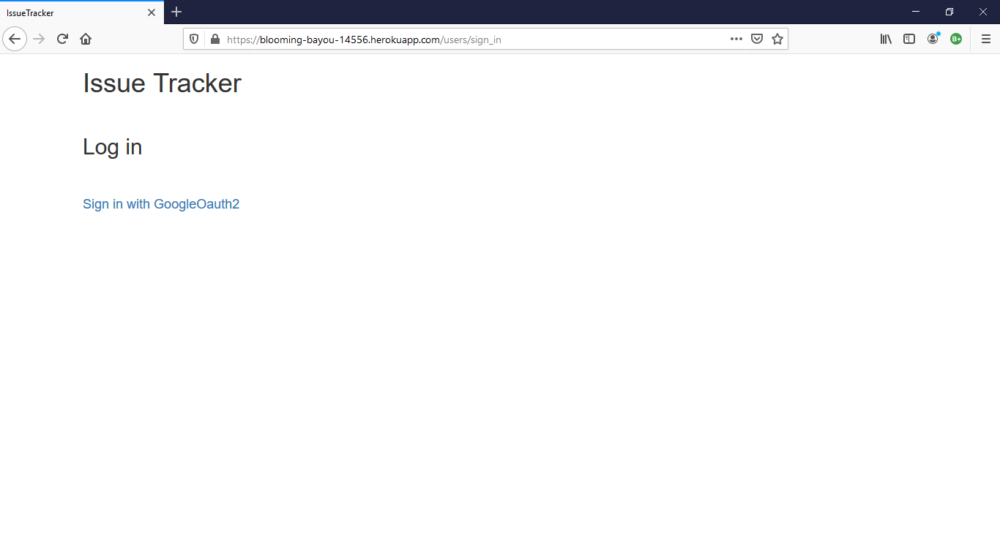
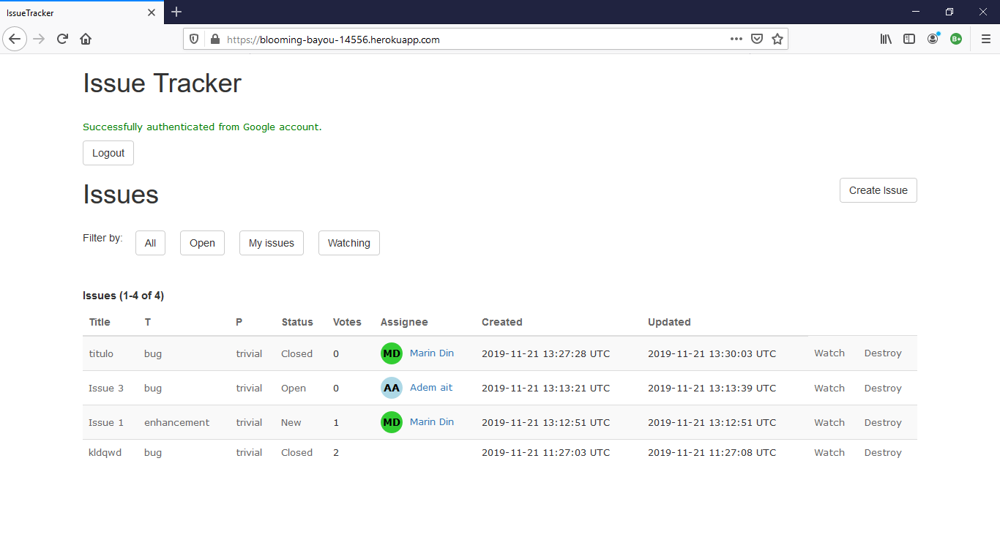
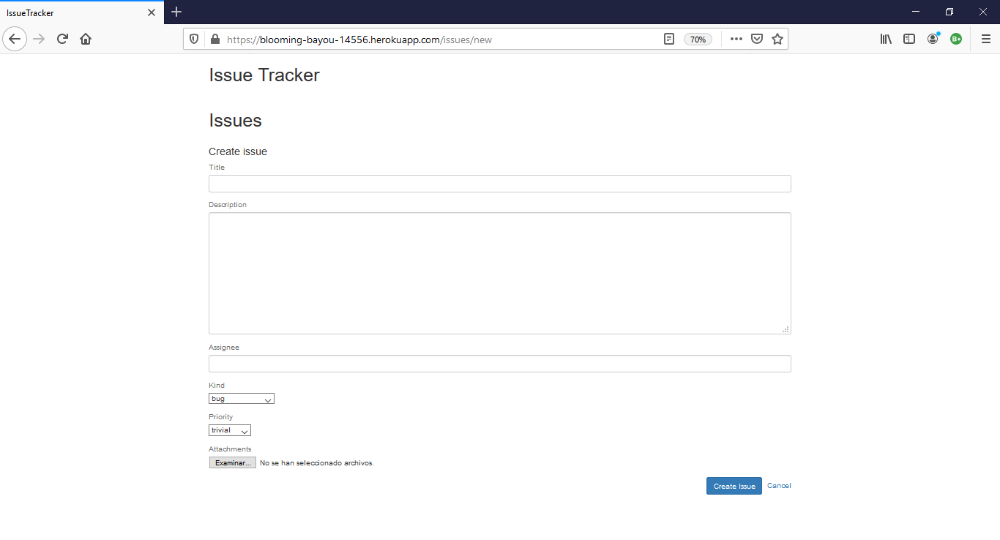
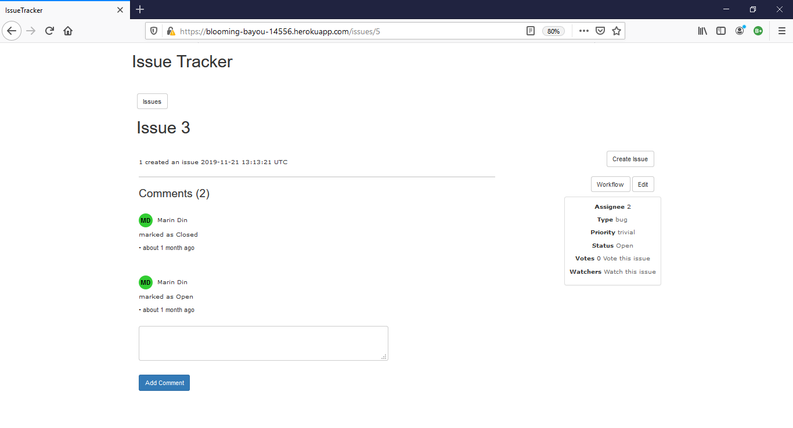
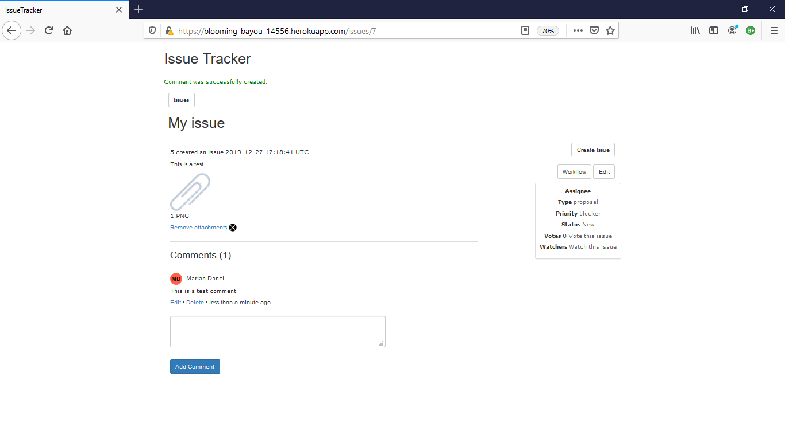
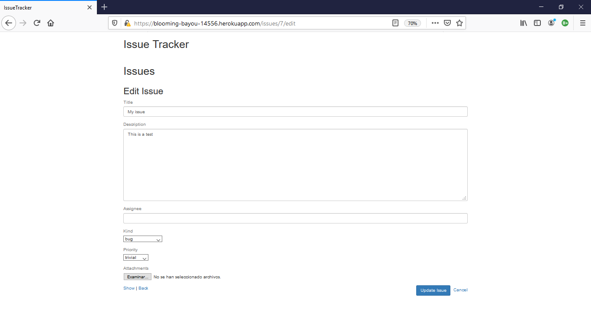

# IssueTracker

A web app made with Ruby on Rails, based on the issue tracker of Bitbucket.

## Screenshots

#### Login

#### Issues

#### Create issue

#### Issue details

#### Issue details attachment

#### Edit issue

## Authors
- Danci, Marian Dumitru
- Ait Fonollà, Adem
- Segura Sánchez, Enric
- Conesa Gago, Agustí

Link heroku:
https://blooming-bayou-14556.herokuapp.com
